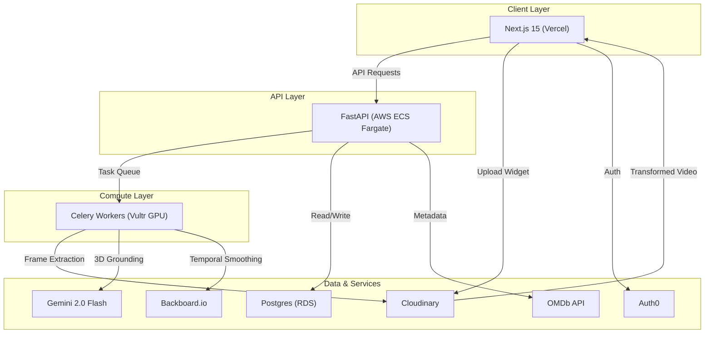
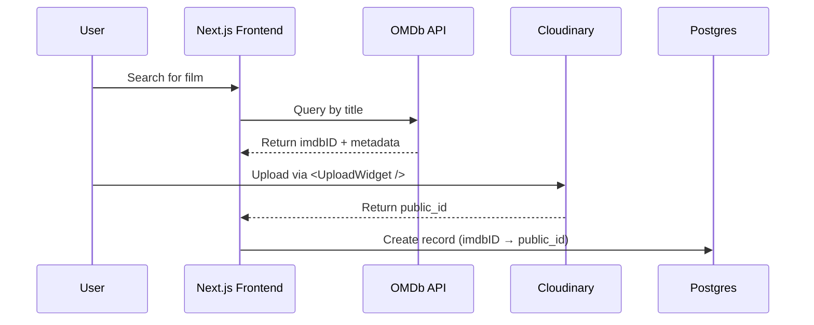
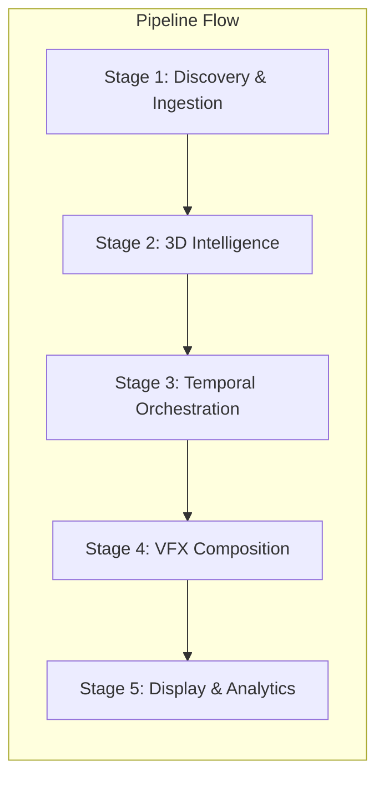
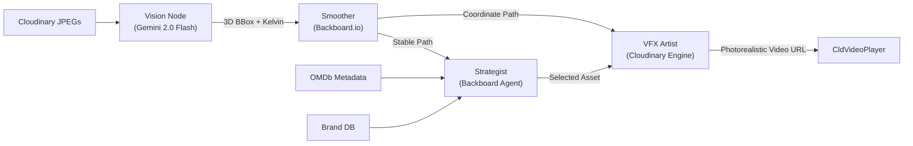

# Full-Stack VPP Architecture

---

## 🏗️ 1. Infrastructure & Deployment Layer

Before any code runs, the environment is architected for high-performance media compute.

| Component | Technology | Purpose |
|---|---|---|
| **Frontend Hosting** | Vercel | Hosts the Next.js 15 app. Optimized for edge-rendering OMDb search results and streaming the Cloudinary Video Player. |
| **API Orchestration** | AWS ECS Fargate | A containerized FastAPI cluster handling request routing, OMDb metadata fetching, and database transactions. |
| **Heavy Compute** | Vultr GPU Nodes | Dedicated Ubuntu instances with NVIDIA GPUs running Celery Workers for FFmpeg frame shredding and local AI inference. |
| **Database** | Postgres + Prisma (`prisma-client-py`) | Ghost-Merchant schema: Stores the `imdbID` movie index (`Video`) and 3D Ad Slots (`AdSlot` with JSON BBox coordinates). Typed Python client for FastAPI. |
| **Identity** | Auth0 | Manages Role-Based Access Control (RBAC) separating the Creator Dashboard (uploading) from the Brand Dashboard (bidding/placement). |

---

## 🚀 2. The Five-Stage Processing Pipeline

### Stage 1: Discovery & Media Ingestion

> **Goal:** Ingest assets and establish a content library.

1. **OMDb Discovery** — The user searches via a Netflix-style UI. The system maps the film to a unique `imdbID`.
2. **Cloudinary Ingestion** — Creators upload raw clips using the Cloudinary `<UploadWidget />`.
3. **System Action** — Upon upload, Cloudinary returns a `public_id`. A record is created in Postgres linking `imdbID → cloudinary_public_id`.

---

### Stage 2: 3D Intelligence (The "Spatial Eye")

> **Goal:** Convert 2D video into a 3D mapped environment.

1. **Frame Extraction** — FastAPI triggers a Celery worker on Vultr. The worker calls Cloudinary's dynamic URL extraction (e.g., `f_jpg,so_10`) to pull keyframes without downloading the full video.
2. **Vision Node (Gemini 2.0 Flash):**
   - **3D Grounding** — Analyzes frames to detect "Ad Slots" (flat surfaces, hands).
   - **Output** — Returns a 9-point 3D Bounding Box: `[x, y, z, w, h, d, roll, pitch, yaw]`.
   - **Environmental Logic** — Detects Kelvin temperature (e.g., `4500K`) and shadow direction.

> [!TIP]
> **Long-Form Video Optimization (45m+)**
> Gemini 2.0 Flash has a 1-million-token context window, fitting ~45-55 mins of video. For feature films (2h+), FastAPI/Celery chunks the video into 30-min segments via FFmpeg and processes them in parallel.
> To further stretch the token limit (up to 2.7 hours per request), we pass `mediaResolution: 'low'` to the Gemini API, preserving enough bounding box fidelity while saving tokens.

---

### Stage 3: Temporal Orchestration (The "Consistency Memory")

> **Goal:** Lock the virtual object to the moving world.

1. **Temporal Resonance (Backboard.io)** — Raw coordinates are streamed to Backboard.io.
2. **Anti-Jitter Logic** — Backboard compares Frame *N* with Frame *N+1*. If Gemini's detection shifts by **< 2%**, Backboard "pins" the coordinate to prevent visual vibration.
3. **Ad-Planner Agent** — A Backboard.io Agent reads the OMDb genre (e.g., *"Sci-Fi"*) and the Gemini scene intent (e.g., *"Luxury Interior"*) to auto-select the best brand asset from the catalog.

---

### Stage 4: VFX Composition (The "Edge Renderer")

> **Goal:** Apply high-end VFX without a rendering farm.

1. **Homography Calculation** — The backend projects the 3D box vertices onto the 2D frame plane, resulting in **8 specific coordinates** (4 corner pairs).
2. **Cloudinary Transformation** — The app generates a complex URL:
   - `l_<brand_asset_id>` — The product overlay.
   - `e_distort:x1:y1:x2:y2:x3:y3:x4:y4` — Warps the 2D PNG into the 3D perspective.
   - `e_colorize` — Tints the product to match the scene's lighting.
   - `e_multiply` — Blends the film's grain and shadows over the product for realism.

---

### Stage 5: Interactive Display & Analytics

> **Goal:** Engage the viewer and track performance.

1. **Streaming** — The transformed video is rendered using `<CldVideoPlayer />`.
2. **Interactive Layer** — A Tailwind-styled Canvas overlay triggers a *"Learn More"* button at the exact coordinates and timestamp of the placement.
3. **Conversion Tracking** — Auth0-secured brand dashboards display *"Hover"* and *"Click"* metrics generated by the player.

---

## 🧩 3. Node-Level Deep Dive

| Node | Model / Tech | Input | Output |
|---|---|---|---|
| **Vision** | Gemini 2.0 Flash | Cloudinary JPEGs | 3D BBox + Kelvin |
| **Smoother** | Backboard.io | Raw 3D JSON | Stable Coordinate Path |
| **Strategist** | Backboard Agent | OMDb + Brand DB | Optimal Asset Selection |
| **VFX Artist** | Cloudinary Engine | Product PNG + Path | Photorealistic Video URL |

---

## 🛠️ 4. Full Tech Stack Summary

| Component | Technology | Implementation Detail |
|---|---|---|
| **Frontend** | Next.js 15 + TypeScript | `npx create-cloudinary-react` starter kit |
| **Video Engine** | Cloudinary | `e_distort` for 3D perspective, `e_multiply` for blending |
| **3D Vision** | Gemini 2.0 Flash | Native 3D Spatial Grounding and Scene Sensing |
| **State Memory** | Backboard.io | Temporal Resonance for anti-jitter consistency |
| **Metadata** | OMDb API | Netflix-style discovery and indexing via `imdbID` |
| **Backend** | FastAPI + Celery | Async worker management for Vultr GPU tasks |
| **Database** | Postgres + Prisma | Ghost-Merchant schema (`Video` ↔ `AdSlot` relations) with `prisma-client-py` for native FastAPI asyncio integration |
| **Identity** | Auth0 | RBAC for secure Brand vs. Creator access |

---

## ✅ 5. Cloudinary Challenge Compliance Check

| Requirement | Status | Detail |
|---|---|---|
| Framework | ✔️ | Bootstrapped via the React AI Starter Kit |
| Ingestion | ✔️ | Uses the mandatory Upload Widget for all creator uploads |
| Transformation | ✔️ | Features `e_distort` (Warping) and `e_multiply` (Blending) |
| Display | ✔️ | Streams results through the `<CldVideoPlayer />` component |
| Innovation | ✔️ | First-of-its-kind 3D-to-2D Perspective Mapping via Cloudinary |
